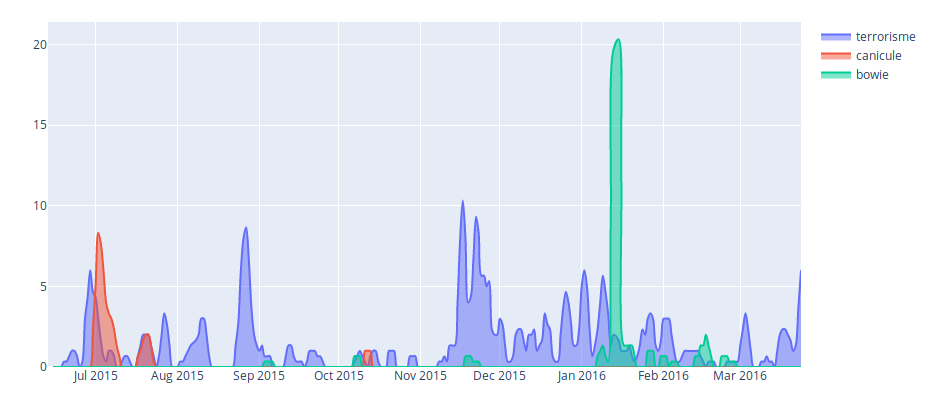

# What's Up In The (French) Media
Collect daily data from French websites

# Basic analysis

A basic data analysis is provided using [nltk](https://www.nltk.org/) and [beautifulSoup4](https://www.crummy.com/software/BeautifulSoup/bs4/doc/)

To install the requirements:

```bash
apt-get install python3-bs4
pip3 install --user -U nltk numpy pandas jupyter
```

Sample of visualization:


